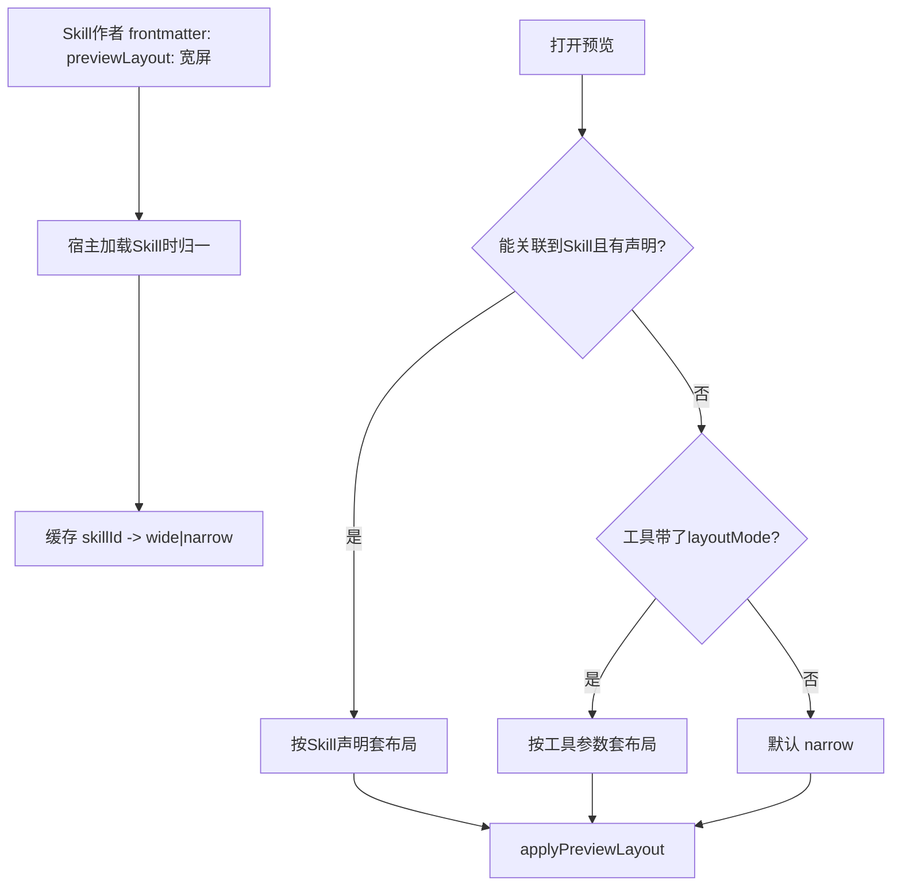

# 预览宽屏 / 窄屏布局方案

## 目标布局（已对齐截图）


| 模式             | 左侧菜单                                   | 会话区 | 预览宽                |
| -------------- | -------------------------------------- | --- | ------------------ |
| **narrow（默认）** | 展开（约 284px）                            | 可见  | **375px**          |
| **wide**       | **整栏收起**（`SIDEBAR_COLLAPSED_WIDTH=54`） | 可见  | **1200px**（仍受窗口裁剪） |


适用范围：所有预览打开路径；**不再按是否 BIP 决定布局**。

## 契约（已定：方案 A — 中文友好 Skill 元数据）

Skill 作者**不接触**内部枚举 `layoutMode`；只写产品语义「宽屏 / 窄屏」。




### 优先级（宿主）

1. **可选工具覆盖** `layoutMode`（内部/调试用；Skill 规范不要求作者填写）
2. **已关联 Skill 的 `previewLayout`**（frontmatter，中文优先）
3. **默认 `narrow`**

### Skill 作者写法（A）

```markdown
---
name: my-bip-workbench
description: ...
previewLayout: 宽屏
---
```

宿主归一规则（加载时一次完成）：


| 作者可写                              | 内部值              |
| --------------------------------- | ---------------- |
| `宽屏` / `wide` / `wide-screen`     | `wide`           |
| `窄屏` / `narrow` / `narrow-screen` | `narrow`         |
| 缺省 / 非法值                          | 视为未声明 → 打开时走默认窄屏 |


作者文档只暴露中文「宽屏 / 窄屏」；英文别名兼容已有英文 Skill，不要求作者学枚举。

### 如何关联到「当前 Skill」

按序取第一个可解析来源（关联不上 → 当无声明）：

1. `browser_navigate_bip.pathSource` 匹配 `skill: <name> ...`
2. 会话 composer 当前偏好/选中技能（`preferredSelectedSkillId` 等已有链路）
3. 多 Skill 且无法唯一确定 → **不猜**，默认窄屏（或仅当工具显式 `layoutMode` 时覆盖）

### 可选工具参数（非 Skill 作者职责）

```ts
layoutMode?: 'narrow' | 'wide'  // 仅覆盖；缺省不传
```

- 各打开类工具**共用一段 schema**，布局逻辑仍只在 `applyPreviewLayout` 一处
- **不写进 Skill 作者指南**；避免与作者耦合

## 核心代码改动

### 1. 布局应用层

替换 `[useChatPreviewController.ts](src/pages/Chat/useChatPreviewController.ts)` 的 `applyBipPreviewLayout`：

- `applyPreviewLayout({ sessionKey, previewId, mode })`
- 按 `sessionKey + previewId` 一次性去重（防 SPA 反复收栏）
- wide / narrow 套用上表；关预览恢复因 wide 收起的侧栏
- **删除**「可信 BIP → 自动 wide」

### 2. Skill frontmatter 解析与缓存

- 在现有 Skill 元数据加载路径解析 `previewLayout`
- 归一函数独立可单测（中英文别名表）
- 按 `skillId` / skill name 缓存，供打开预览时 resolve

### 3. 打开预览时 resolve + 可选工具覆盖

- 从 tool args / navigate-bip payload / pathSource / composer 选中技能解析 mode
- 工具 `layoutMode` 若存在则覆盖 Skill 声明
- `[electron/api/routes/browser-agent.ts](electron/api/routes/browser-agent.ts)` 可透传可选 `layoutMode`（非必须）

### 4. UE / 文档

- 改 `[docs/preview-area-spec.md](docs/preview-area-spec.md)` 第 6 条：默认窄屏；Skill `previewLayout: 宽屏` 时收栏 + 1200；与是否 BIP 无关
- Skill 作者文档 / 模板：只说明 `previewLayout: 宽屏|窄屏`
- 同步 bip-preview、README 中「BIP 自动宽屏」表述

## 行为细则


| 场景                                 | 行为                  |
| ---------------------------------- | ------------------- |
| 无 Skill / 无 frontmatter            | narrow              |
| `previewLayout: 宽屏` 且能关联到该 Skill   | wide                |
| Skill 宽屏 + 工具 `layoutMode: narrow` | narrow（覆盖）          |
| BIP 但无声明                           | narrow（破坏性变更，需产品知情） |
| 用户手动展开侧栏                           | 同 previewId 不再自动收起  |
| 关预览                                | 恢复侧栏                |


## 主要风险

1. UE 规范冲突 — 先确认
2. Skill 关联不准（多 Skill）— 不猜，默认窄；需要宽屏时保证 pathSource / 选中技能可解析
3. BIP 不再自动宽 — 需宽屏的 Skill 补 `previewLayout: 宽屏`
4. 作者写错字段名 — 文档与 Skill 模板写清；非法值静默当未声明

## 验收

- 无声明打开任意页（含 BIP）→ 窄屏
  - Skill `previewLayout: 宽屏` 且关联成功 → 宽屏2
- 工具 `layoutMode` 可覆盖 Skill 声明
- 手动展开菜单不被二次收起；关预览恢复菜单

